# Halo Bunda — Architecture & Flow Diagrams

## 1. Application Architecture

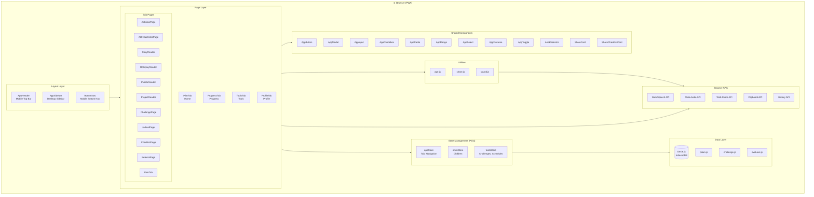

## 2. Navigation Flow

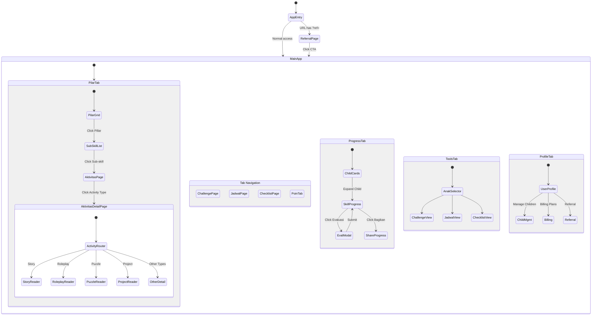

## 3. Home Page (Pilar) Detailed Flow

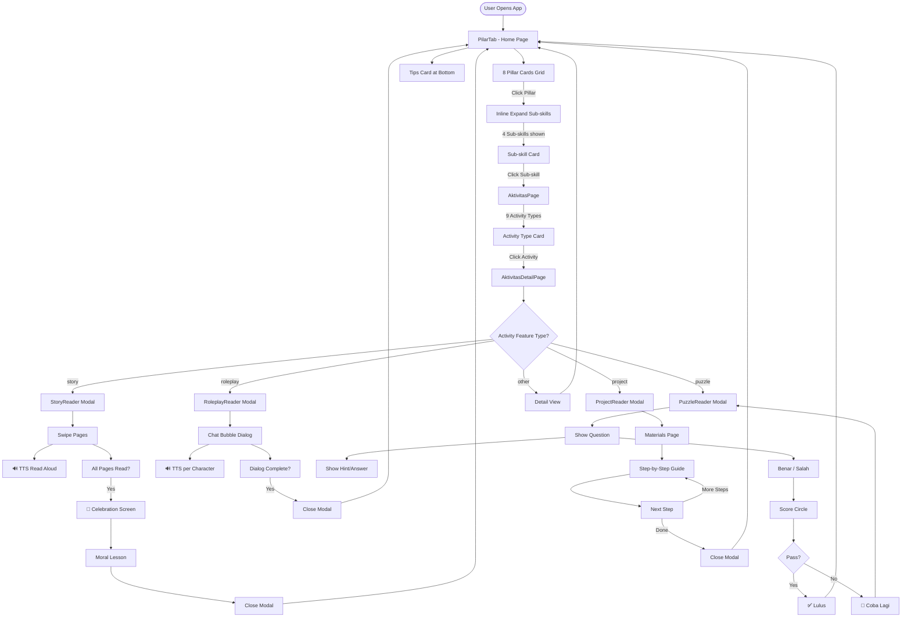

## 4. Data Flow Architecture

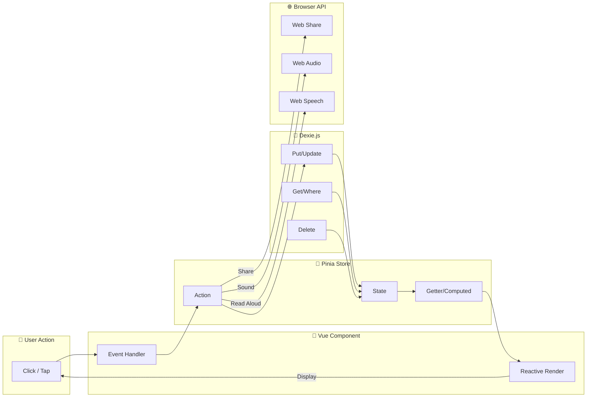

## 5. Child Management Flow

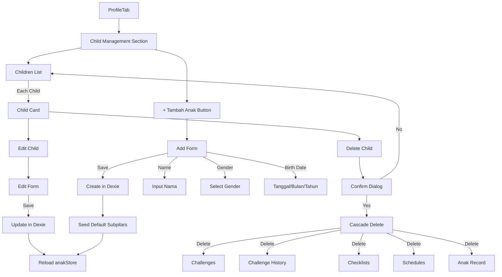

## 6. Challenge & Points Flow

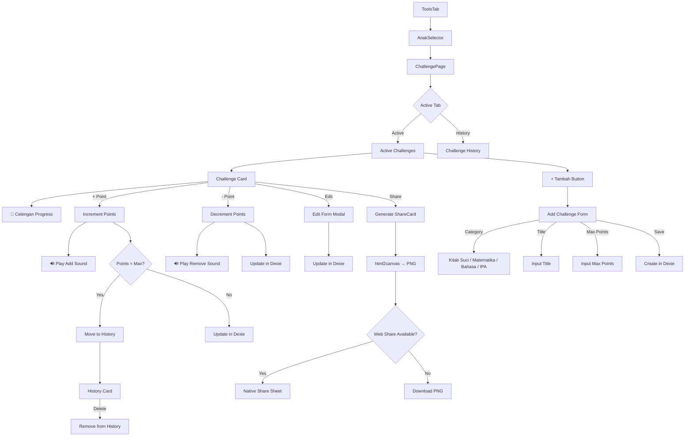

## 7. Evaluation & Progress Flow

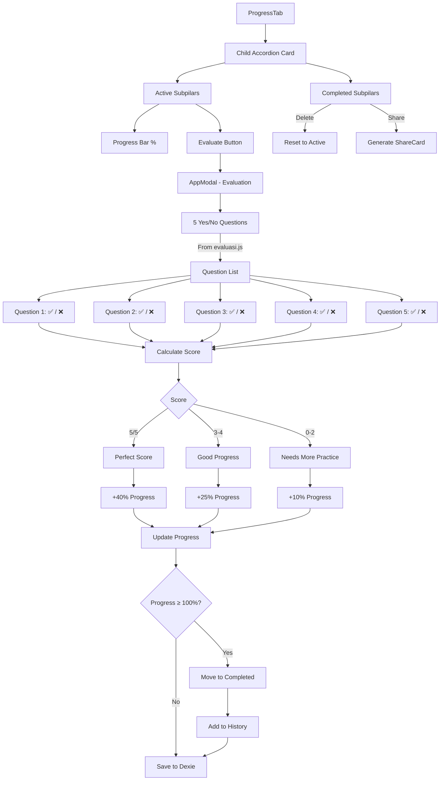

## 8. Responsive Layout Flow

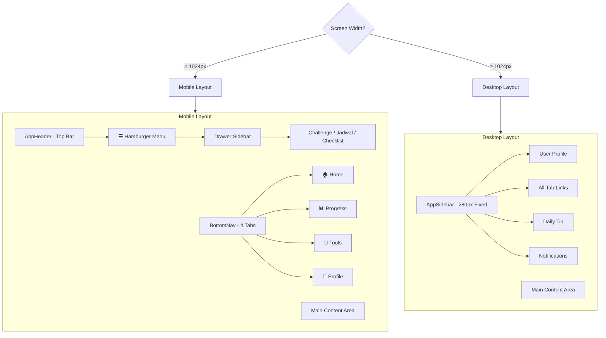

## 9. Share Feature Flow

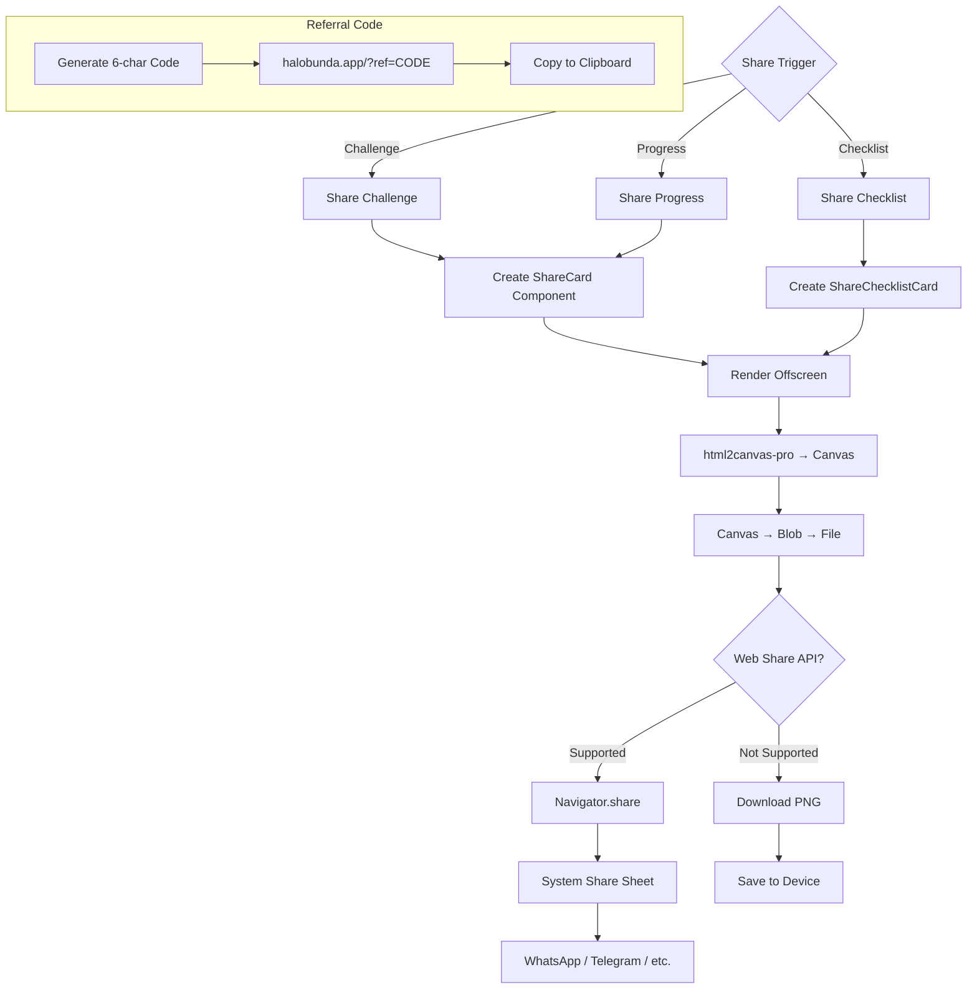

## 10. PWA Install Flow

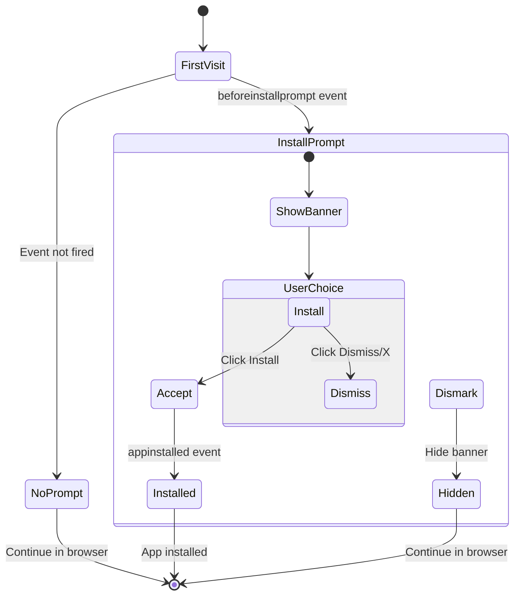

## 11. Database Schema (ER Diagram)

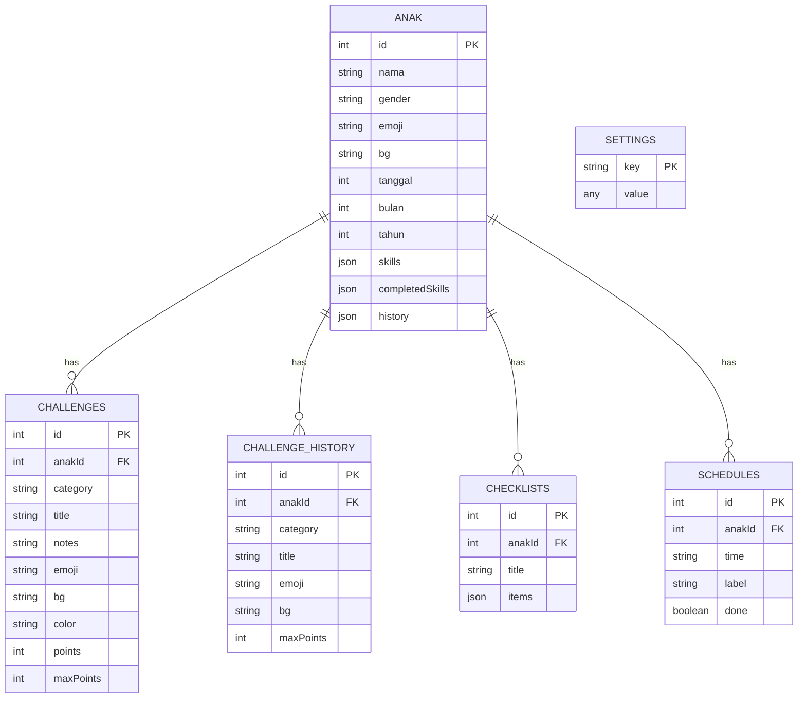

## 12. Component Dependency Graph

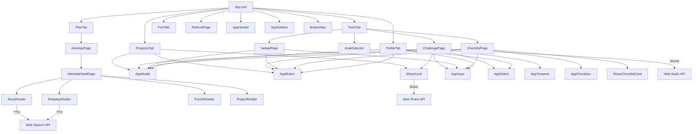

---

*Generated: 2026-06-07 | Halo Bunda v1.0.0*
